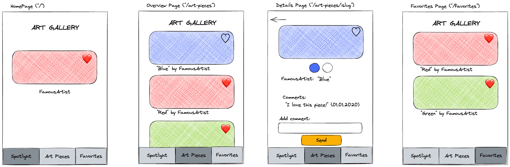

# Recap Project 5: Art Gallery

In this project, your team will create an interactive art gallery app.

This is a group project, so please create **only one project per group** follow this [guide to setup your repository](./docs/github-respository-template.md).

## Overview

In this project, we will create an art gallery app with four pages: **Spotlight**, **Gallery**, **Favorite**, and **Detail**. Users can like or unlike art pieces, and liked pieces will appear on the **Favorite** page.



## API

We will fetch all necessary information about the art pieces from an API specifically designed for this course. [Check out the API](https://example-apis.vercel.app/api/art).

```bash
https://example-apis.vercel.app/api/art
```

## Resources

Download a [Favorite Icon](https://lucide.dev/icons/) and save it in an "assets" folder within your app's main directory.
